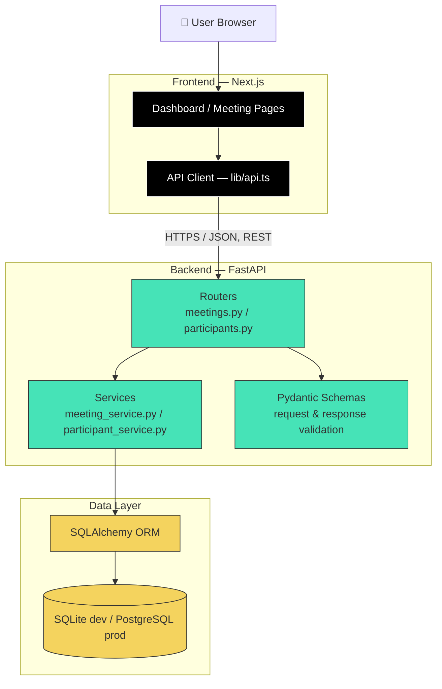
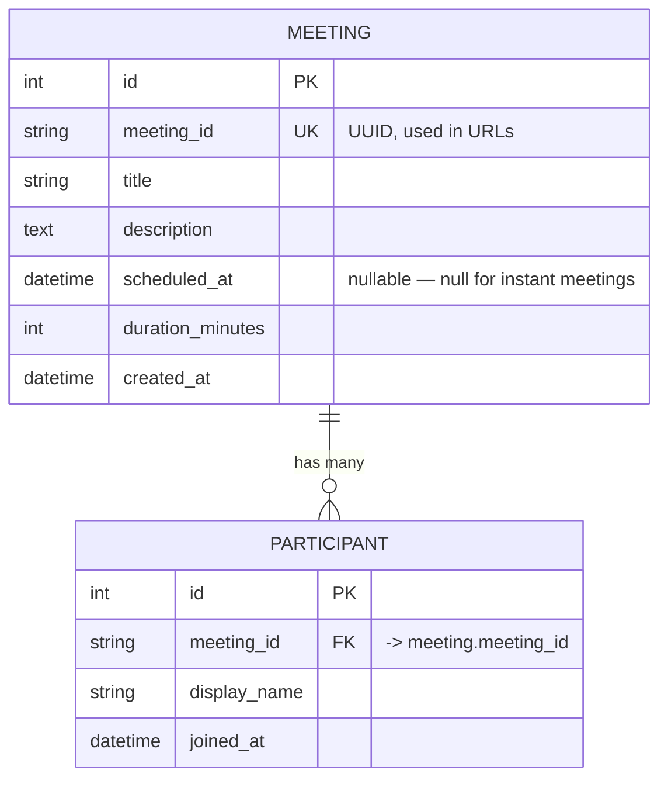
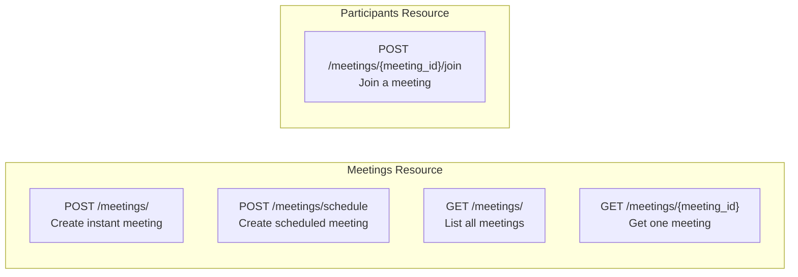
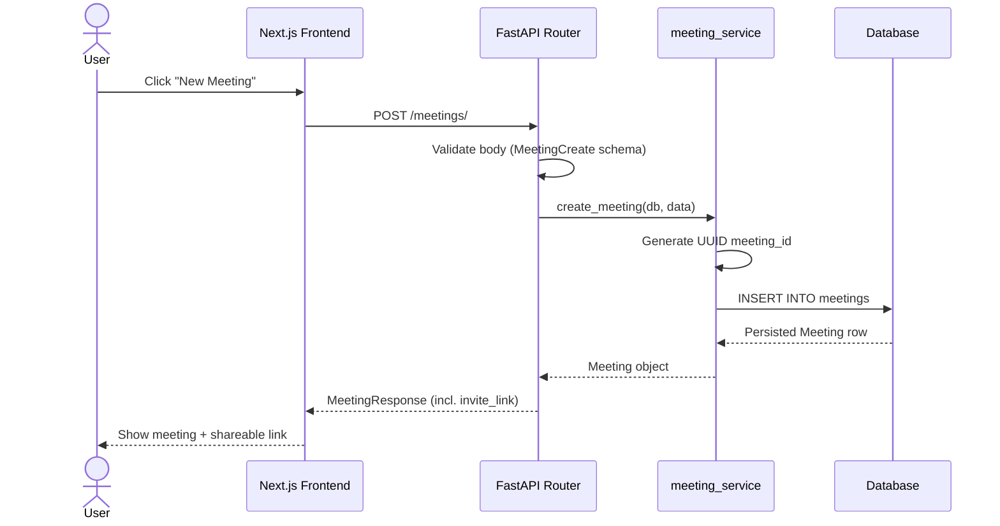
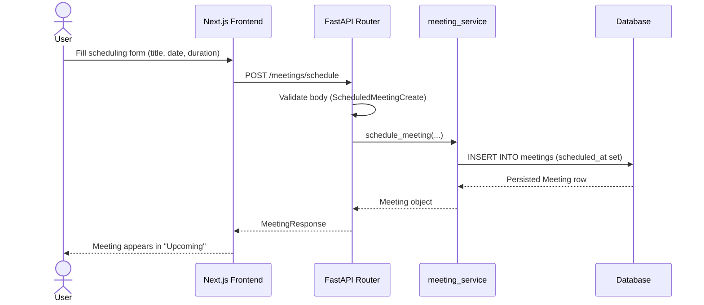
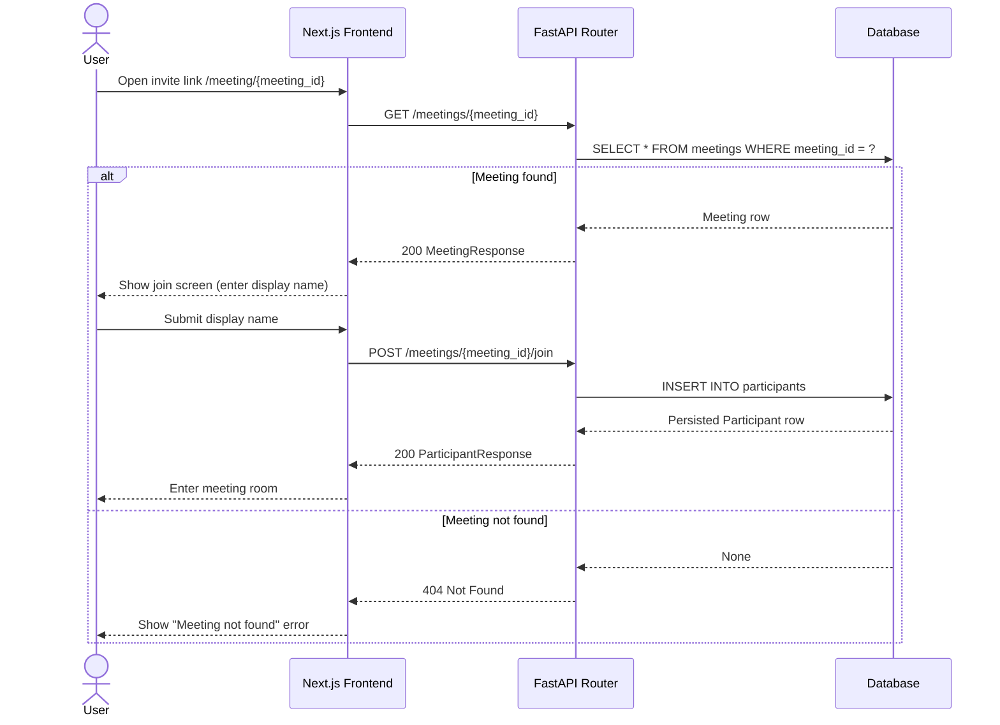

  <h1>📐 System Design — Zoom Clone</h1>
  
<strong>Architecture, data model, and request flows for the Zoom Clone application.</strong>

  

    <a href="#1-high-level-architecture">High-Level Architecture</a> •
    <a href="#2-data-model">Data Model</a> •
    <a href="#3-api-design">API Design</a> •
    <a href="#4-request-flows">Request Flows</a> •
    <a href="#5-design-decisions">Design Decisions</a> •
    <a href="#6-future-improvements">Future Improvements</a>
  

---

## 1. High-Level Architecture

The system follows a simple **client → API → database** architecture with a clean separation between the presentation layer (Next.js) and the service layer (FastAPI).

**Layer responsibilities:**

| Layer | Responsibility |
|---|---|
| **Frontend (Next.js)** | Renders dashboard, meeting creation/scheduling forms, and join screens. Calls the backend via a typed API client. |
| **Routers** | Define REST endpoints, parse/validate input via Pydantic schemas, delegate to services. |
| **Services** | Contain business logic — generating meeting IDs, timestamps, and querying the DB. Kept separate from routers so logic is testable and reusable. |
| **Models (SQLAlchemy)** | Define the DB schema (`Meeting`, `Participant`) and map rows to Python objects. |
| **Database** | SQLite locally for zero-setup development; PostgreSQL in production via `DATABASE_URL`. |

 

## 2. Data Model

The schema is intentionally minimal: two tables, one relationship.

**Notes:**
- `meeting_id` is a UUID string (not the auto-increment `id`) — this is the public identifier used in invite links (`/meeting/{meeting_id}`), so internal DB IDs are never exposed.
- A meeting with `scheduled_at = null` is treated as an **instant meeting**; a non-null value marks it as **scheduled**.
- `Participant.meeting_id` is a foreign key to `Meeting.meeting_id` (not the primary key), keeping the public UUID as the join key throughout the system.

 

## 3. API Design

REST API exposed by the FastAPI backend, grouped by resource:

| Method | Endpoint | Request Body | Response | Notes |
|---|---|---|---|---|
| `POST` | `/meetings/` | `title?, description?, scheduled_at?, duration_minutes?` | `MeetingResponse` | Generates a UUID `meeting_id`, sets `created_at` server-side. |
| `POST` | `/meetings/schedule` | `title, description?, scheduled_at, duration_minutes (>0)` | `MeetingResponse` | Same as above but `title`, `scheduled_at`, `duration_minutes` are required. |
| `GET` | `/meetings/` | — | `MeetingResponse[]` | Ordered by `created_at` descending (most recent first). |
| `GET` | `/meetings/{meeting_id}` | — | `MeetingResponse` | 404 if not found. |
| `POST` | `/meetings/{meeting_id}/join` | `display_name` | `ParticipantResponse` | Records a participant against the meeting. |

Every `MeetingResponse` includes a computed `invite_link` field (`/meeting/{meeting_id}`) so the frontend never has to build the URL itself.

Validation is handled entirely by **Pydantic schemas** at the router boundary — invalid payloads are rejected with `422` before ever reaching the service layer.

 

## 4. Request Flows

### 4.1 Creating an instant meeting

### 4.2 Scheduling a future meeting

### 4.3 Joining a meeting

 

## 5. Design Decisions

| Decision | Rationale |
|---|---|
| **UUID `meeting_id` separate from DB `id`** | Prevents leaking sequential primary keys in public URLs and avoids meeting IDs being guessable. |
| **Router / Service / Model separation** | Keeps HTTP concerns (validation, status codes) out of business logic, making services independently testable and reusable. |
| **Pydantic schemas for I/O** | Guarantees the API rejects malformed input before it reaches the database, and gives the frontend a strongly-typed contract (mirrored in TypeScript). |
| **SQLite for local dev, PostgreSQL for prod** | Zero-setup onboarding for new developers (no DB install needed) while still supporting a production-grade relational DB via `DATABASE_URL`. |
| **Stateless REST API** | No server-side session state — every request is self-contained, which makes the backend trivial to scale horizontally behind a load balancer. |

 

## 6. Future Improvements

- **Real-time video/audio** — integrate WebRTC (e.g. via a signaling server or a provider SDK) for actual video calls; today the app models meeting metadata and participants but does not carry media.
- **Authentication** — add user accounts so meetings can be tied to a host, with host-only controls (mute/remove participants, end meeting).
- **Real-time participant list** — use WebSockets to push live join/leave events to everyone in a meeting instead of relying on polling.
- **Notifications/reminders** — email or push reminders for scheduled meetings.
- **Rate limiting & abuse prevention** — throttle meeting creation and join attempts per IP/user.
- **Horizontal scaling** — since the API is stateless, it can be scaled out behind a load balancer; the database would then become the primary scaling bottleneck (mitigated via connection pooling and read replicas).
